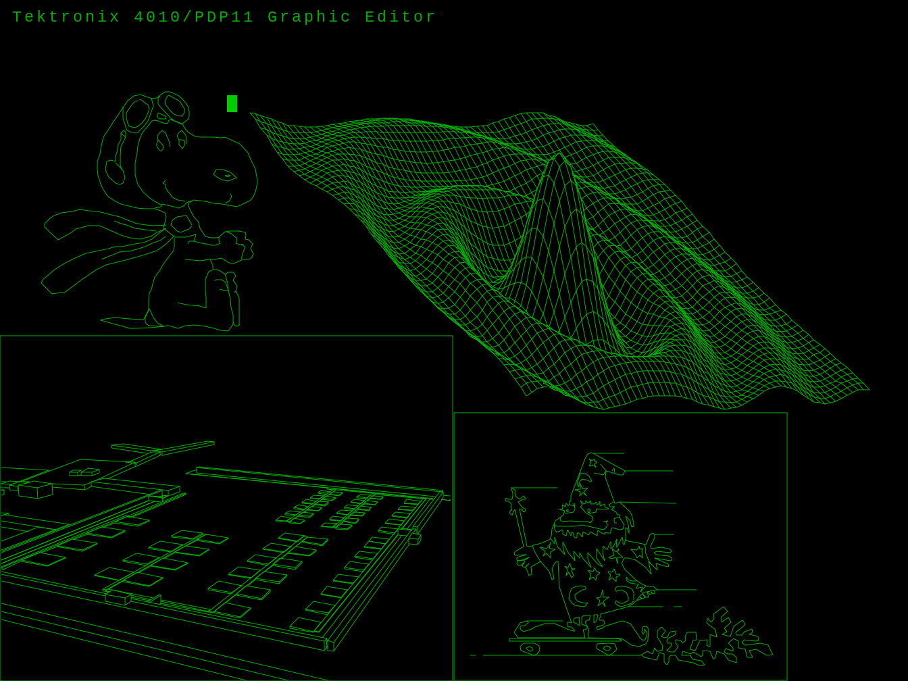

# Tek4010 Emulator

Tek4010 is an emulator for Tektronix 4010/4014 graphics
terminals. It reproduces the behavior of the original
storage tube display, including realistic drawing speed
and the true fading of the drawing spot over time.

This makes it possible to experience historical plot
files and legacy Unix systems as they originally behaved.

▶️ Watch the emulator in action:
[Tektronix 4010 Emulator – Authentic Storage Tube Graphics at Original Speed](https://youtu.be/vk9uMM8LpFk?si=PhAek8d5fDDl-oHd)

---

## Installation

Choose your platform:

- Raspberry Pi / Linux → [raspberrypi.txt](raspberrypi.txt)
- macOS → [macos.txt](macos.txt)
- Windows (WSL) → [windows.txt](windows.txt)

These files contain a short and simple installation guide.

More detailed instructions are available in:

- [docs/raspberrypi.md](docs/raspberrypi.md)
- [docs/macos.md](docs/macos.md)
- [docs/windows-wsl.md](docs/windows-wsl.md)

---

## Quick test

After installation, run in your Tek4010 directory:

    make test

You should see a graphical display.

---

## Examples

Examples and demo files are included in the repository:

- demos/demo.sh
- pltfiles/
- ardsfiles/

---

## Notes

- This project is distributed as source.
- Installation is intentionally simple and transparent.
- If something does not work on a future system,
  it can be adapted locally.

---

## Background

This emulator is designed to support historical
Unix environments and related hardware projects
such as PiDP-11 systems.

## Usage

- Quick start → [docs/quickstart.md](docs/quickstart.md)
- Full manual → [docs/manual.pdf](docs/manual.pdf)
